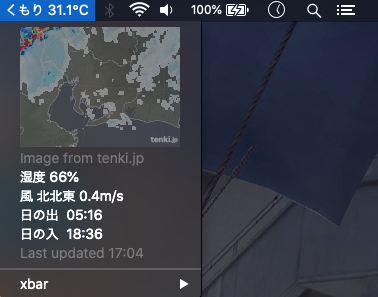

# Weather applications

Weather applications developed with various technologies and environments (GNU/Linux, MacOS and Windows). Scraps data from 2 providers, `tenki.jp` and `weathernews.jp`.

## [CLI application](https://github.com/ndlopez/fetch_tenki/tree/main/get_tenki)

First attempt to extract weather data from a webpage (tenki.jp). Displays current weather conditions, updated every 3 hours.

## [Notification apps]

### [GNOME Extension](https://github.com/ndlopez/fetch_tenki/tree/main/notification/tenki%40moji.physics)

Display a notification every 30min.

Works on GNOME 40+ versions


Should probably create a new branch for this repository
```sh
$ git branch gnome-ext

$ git checkout -b gnome-ext
```
Then pull-request to merge with main

### [MacOS Notification](https://github.com/ndlopez/fetch_tenki/tree/main/notif_app/mac_os)

Display @the Notification Center and pop up every 30 minutes.

Manual update is required unless set on cron, some CJK chars are converted to Unicode.

It takes a few seconds to load, cuz it has to download new data, process it and then convert it.


### xBar plugin

[repo](https://github.com/ndlopez/fetch_tenki/tree/main/notification/xbar_plugin)

Plugin to display current conditions and radar image, all courtesy from tenki.jp.



### [Windows Notification](https://github.com/ndlopez/fetch_tenki/tree/main/notification/windows)

Windows PopUp message application using Powershell to display.

Auto-updates using task-scheduler.

## Data forecaster

Failed attempt to predict future data using sklearn's forecaster model and past observation data.

---
Enviroment: 
- MacBookPro/MacOS 15.5<br>
- Panasonic Let'sNote/Linux Fedora 36<br>

Languages: Shell, JavaScript, Ruby<br>
Editors: VIM and Emacs

