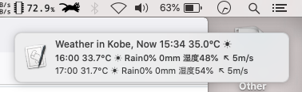
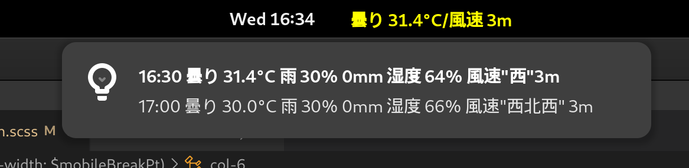

# Notification app

Currently these apps use installed Python v.3 to fetch/scrape/process  data. A binary is in consideration for the Windows repo.

## MacOS version
Public repository for notification branch, which is set for MacOS environment.

By removing [out_file] it can work on GNU/Linux as well.



To display as a notification do:<br>
```sh
$ /bin/bash grep_tenki.sh<br>

$ osascript -l JavaScript notif_app.js
```

## GNOME extension

Download a copy from the repo [tenki@moji.physics] and set it to GNOME extensions directory:

> $HOME/.local/share/gnome-shell/extensions

Modify `grep_tenki.sh` to set your area, default Kobe city. Get other codes either directly from [tenki.jp] or [weather.yahoo.jp]

To auto-update data, set above file into [cron] to fetch new data.

To change display time, modify `extension.js` replace line $63$ default time $1653$ to another time in seconds.

```js
function enable(){
    Main.panel._centerBox.insert_child_at_index(panelBtn,1);
    timeout=Mainloop.timeout_add_seconds(1653,setGrepTenki);
}
```



## Windows 10/11 version

Display weather information using the Windows notification system and a PowerShell snippet. Once set on task Scheduler it will run every set time.
 
## Environment
- Language: JavaScript, Python3, Ruby and Bash
- Editors: Emacs and VIM
