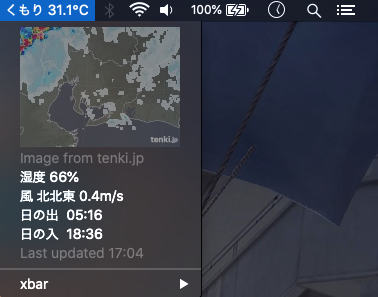

# MacOS xbar plugin
Fetch current weather data from weathernews.jp

Add *currWeather.1h.sh* to your plugins folder and set Refresh to 1hr

Another plugin: 
*get_tenki.1h.py* uses BeautifulSoup and urlopen libraries to fetch/scrape data from tenki.jp. Output looks like this: 
18:05 曇り 29.7C 40% 0mm 76% 静穏 0m/s 
19:00 弱雨 28.1C 60% 1mm 88% 北西 2m/s

# Extra info
Toggle betwen dark and light mode in MacOS 10.15 
	$ osascript -e 'tell app "System Events" to tell appearance preferences to set dark mode to not dark mode'

## Environment
- MacBookPro, MacOS 15.5
- Editors: Emacs and VIM
