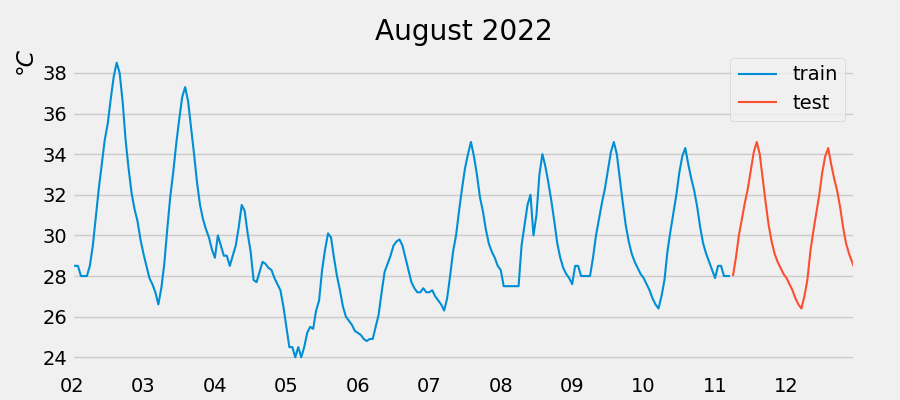

# Forecast weather data with skforecast library and scikit-learn

Data to be trained should have no gaps, if there are gaps, fill them with Pandas, by adding the previous number or *np.nan*.

Please refer to the following [link](https://www.cienciadedatos.net/documentos/py27-time-series-forecasting-python-scikitlearn.html)

Sample data: weather for Kobe city on August 2022

## Predictions

    |2022-08-11 | 06:00:00  |  28.184|
    |2022-08-11 | 07:00:00  | 28.821|
    |2022-08-11 | 08:00:00  | 29.579|
    |2022-08-11 | 09:00:00  |  30.338|
    |2022-08-11 | 10:00:00  |  31.163|

Freq: H, Name: pred, dtype: float64

test error (mse):4.815604928571416

Quite large error, perhaps sample data is small.

---

Hiperparam grid search:

Refitting `forecaster` using the best found parameters and the whole data set: 
  lags: [ 1  2  3  4  5  6  7  8  9 10 11 12 13 14 15 16 17 18 19 20] 
  params: {'max_depth': 5, 'n_estimators': 100}

The best results are obtained using a time window of 20lags and a random forest set up of *{'max_depth': 5, 'n_estimators': 100}*

In fact with the above mse_error got worst. I should tune in other parameters of the grid_search function.

# Dependencies

Python3.10 on Fedora 36:
- numpy: v1.23.3
- pandas: v1.4.4
- scipy: v1.9.1
- matplotlib: v3.5.2
- scikit-learn: v1.1.2
- skforecast: v0.4.1

Issue regarding installation of current version of skforecast: 
    $ pip install skforecast
    
Returns an error related to python and numpy being deprecated (in spite of using 3.10 and v1.23.0). It says that numpy.distutils is no longer used on python >=3.12. To fix this error better install the following version:  
    $ pip install skforecast==0.4.1
